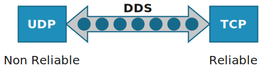
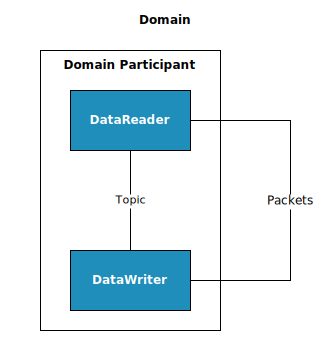
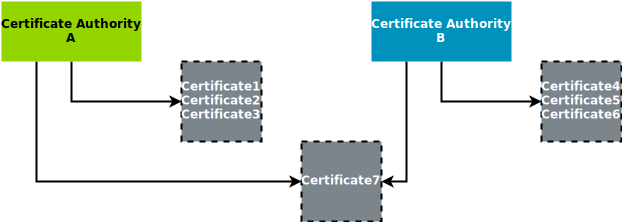

# About libddssec

## High-level architecture

There are two main components of the libddssec project:

 - A library with interfaces that the user's DDS implementation links to.
 - A trusted application that executes under a Trusted Execution Environment
   (TEE) and is used to handle the trusted assets, transformations and
   operations.

Understanding how libddssec works requires understanding a number of concepts
which this document will cover:

 - Data Distribution Service libraries (DDS).
 - TrustZone, more specifically OP-TEE OS and Trusted Applications.
 - Public Key infrastructure (certificates, authentication).
 - Shared Secret generation (Diffie-Hellman).


# DDS

DDS is the acronym for Data Distribution Service. It is used to implement
publisher/subscriber messaging, meaning DDS participants can create or subscribe
to topics. If a node has interest in a topic, the publisher targets its message
to it after registration. DDS is layered on top of the User Datagram Protocol
(UDP) to make use of multicasting. Multicasting allows a node to subscribe to a
router. The sending-node sends only one message to a router with the information
that the message must be sent to all the subscribers. The router distributes
this message to all subscribers of this topic. The advantage of multicasting is
that the sender sends only one message and does not need to know which node is a
subscriber. DDS uses multicasting to discover the different participants for a
topic. After that, it uses unicast and direct messages directly to any
participants.

DDS has a [standard](https://www.omg.org/spec/DDS/About-DDS/), meaning that
multiple instances of DDS should be able to communicate even if they are not
from the same implementation. It is possible to add security, specify where the
client is registered, filter some participants, specify quality of service
(QoS), and add more functionality depending on the application to be more
reliable or prioritize some data.

Networking has the following issues that should be taken into account:

 - When using non-wired connection (WiFi, Bluetooth) or even with wired
   connection (Ethernet), the system can lose some packets if the nodes are far
   away, or if there is interference.
 - The network capacity must be enough to avoid message drop. However, if there
   is a lot of traffic, this might not be enough.

The Quality of Service (QoS) can be specified for all topics created. It means
that some packages can be prioritized depending on the network congestion. This
is needed because DDS is layered on top of UDP which is not a reliable service -
it is sends data without any confirmation that the receiver actually receives
it. DDS has different level of granularity that can help to achieve a networking
service close to TCP meaning that it is possible to have acknowledges (ACKs) of
messages or control of congestion. All those parameters must be defined in the
QoS parameters.



In a typical network, multiple nodes are communicating. For example the
following topics could be exchanged

 - Critical system data (emergency start and stop).
 - Control messages (for movement).
 - Sensor data (temperature, laser, camera,...).

In this case, the critical messages should be configured to have a higher
importance than the sensor data.

## Concepts



Participants are called DomainParticipants

 - DataWriters: can publish data.
 - DataReaders: can subscribe.

DomainParticipants are inside a Domain

 - A Domain is a channel where data flows

Participants communicate over the same:

 - Topic: name of the channel used to exchange messages.
 - TypeName: specify the type of the messages to be exchanged.
 - Quality of Service: Partitions, Network parameters.

For a topic, a message queue is allocated

 - Created to store the correct message type.
 - Depend on a QoS.

Communication is done:

 -  Only inside a subnetwork.
 -  by advertising a topic (multicast).
 -  by communicating directly with the subscribers using unicast.

## Security

Object Management Group (OMG) is the organization which writes the
[DDS protocol
specification](https://www.omg.org/spec/DDS-SECURITY/About-DDS-SECURITY/)

### Plugins
#### Authentication

The authentication plugin is responsible for checking if a participant is
trusted. This is based on the Public Key Infrastructure (PKI), making use of a
Certificate Authority (CA) signing a participant certificate using its private
key. This signature will then be checked by a remote participant using the
public certificate of the CA containing the matching public key. During the
authentication process, a key algorithm is used to deduce a shared secret
between the two participants. The shared secret can use either Diffie-Hellman
(DH) or Elliptic Curve (EC) algorithms depending on the configuration:

 - DH_2048_256.
 - ECDH_prime256v1.

##### Certificates

![A CA has a name, email, an address, a public key, and a private key. The CA is used to generate a certificate, which is sent publicly and contains a name, email, an address, and a public key. The Node Identity, which has a name and a key pair, generates a certificate request from the CA. The certificate request carries a public key and is signed by the CA's private key. After this, it is sent back, now containing the Node Identity's public key, the SHA of the CA's public key, and the CA's signature. This authenticates the node](./media/DDS_certificates.svg)

Prior to execution of an application, the participant private key and
certificate must be generated. The process works as follows:

 - Participant1 generates a set of public and private keys.
 - Participant1 create a certificate signature request (p1.csr).
 - Participant1 asks the CA to fulfill its certificate request: p1.csr.
 - CA will return a signed certificate to Participant1 (CertP1).
 - For this process, the CA signs using its private key.

This CertP1 certificate contains the public key of the Participant1 and the
following fields:

 - Algorithm used by the CA for signing.
 - Hash of the public key and other fields signed using the private key of the
   CA.

A certificate can be signed by multiple CAs and thus can be verified by
different CA certificates.

When a participant is created, it:

 - Loads the CA certificate given as path.
 - Loads its certificate CertPx given as path.
 - Checks if CertPx is signed by the CA and is still valid.
 - Loads its private key and checks if the private key and public key contained
   in CertPx match.

*A participant signs using its private key. The verification is done using the
public key which is contained in the certificate.*

##### Multiple CA and certificates

A certificate can be signed by multiple CAs. Usually a certificate is signed by
a CA that is specific to a company but sometimes they can be shared between
multiple companies and signed by multiple CAs.



##### 3-Way Handshake

When two participants want to communicate, a handshake occurs as follows

 - Request: sent by Participant1 to Participant2 to initiate the key agreement
   protocol. It contains CertP1, a DH public key (DH1), and a challenge1 which
   is a nonce.
 - Reply: sent by Participant2 to Participant1 in response to the Request
   message. It contains CertP2, a DH public key (DH2), challenge1, and
   challenge2. The message is signed by Participant2.

```
Sign(hash(CertP1) | challenge1 | DH1 | challenge2 | DH2 | hash(CertP2))
```

Upon receiving the Reply, Participant1 will check the parameters which were sent
initially (CertP1 | challenge1 | DH1) to make sure they match the initial
values. The signature is verified using the CertP2 containing the public key.
If successful, the Shared Secret is generated on Participant1's side.

 - Final: sent by Participant1 to Participant2 to confirm the receipt of
Handshake-Reply. It contains both challenges and is signed by Participant1.

```
Sign(hash(CertP1) | challenge1 | DH1 | challenge2 | DH2 | hash(CertP2))
```

Upon receiving 'Final', Participant2 will check all the parameters which were
sent (CertP[1-2] | challenge[1-2] | DH[1-2]) to make sure they match the values
stored locally. The signature is verified using the CertP1 containing the public
key. If successful, the Shared Secret is generated on Participant2's side.

##### Handles

The following diagram shows the interaction between the different handles in the
DDS Security design with the different Plugins:

![The SharedSecret Handle is created by the Authentication Plugin and used by the Cryptographic plugin. The Handshake Handle is created by the Authentication plugin and used to derive the SharedSecret Handle. The Identity Handle is Created by the Authentication plugin, is used to authenticate the Handshake Handle, and is used by the Cryptographic plugin and the Data Tagging plugin. The Permission Handle is created by the Access Control Plugin and used by the Cryptographic plugin and the Logging plugin](./media/Handle_usage.svg)

###### Identity Handle

This handle is created for the local and the remote nodes. It loads the CA, CRL,
Public Certificate and Private Key for the local nodes and verifies that:

 - The certificate is signed by the CA
 - The certificate is not in the CRL
 - The certificate and Private Key match
 - The Certificate and CA can be parsed to deduce the algorithm used for
   signing.

For the remote node, only the incoming certificate is stored in this handle. The
certificate must be verified by the CA of the local node doing the handshake and
receiving the data.

The remote handle public key is then used to verify signed data (previously
certified using a remote private key). The local handle private key is used to
certify a message.

In addition, this handle stores the Subject Name and the RFC 2253 Subject Name of
its certificate:

 - Subject Name is used to deduce the participant key GUID
 - The RFC 2253 version is used in the permission plugin

###### Handshake Handle

Specific to a local and a remote identity handles trying to authenticate. It
stores the remote public Diffie-Hellman key and the locally generated
Diffie-Hellman key pair. At the end of the handshake, once the final handshake
message is verified, the two participants have exchanged their public DH key and
their generated challenges. This is used to generate the Shared Secret Handle
described below.

###### Shared Secret Handle

This handle is used in the cryptography plugin. After the handshake and the
derivation of the shared secret, the challenges have been exchanged and the
deduced key are set to this structure.

###### Permission Handle

This handle is used to allow/disallow some operations for a specific publisher /
subscriber. An [S/MIME](https://en.wikipedia.org/wiki/S/MIME) file is created
for a specific application which contains those information which are signed by
a key.

##### Protocol

After local validation passes, the Authentication plugin validates the remote
Participant which has been discovered. It also generates an IdentityHandle which
uniquely identifies that remote Participant in Authentication plugin. To
determine which of the two Participant entities shall initiate the protocol,
each Participant compares its own GUID with the other Participant. The
Participant with the lower GUID (using lexicographical order) initiates the
protocol. Finally, this pair of a local Participant and a remote Participant
both derive a SharedSecret Handle using a 3-way Diffie–Hellman handshake. A
Handshake Handle stores the Diffie-Hellman public key of the remote participant
and the Diffie-Hellman public/private key pair of the local participant. This
SharedSecret Handle is used by both the matched participants to encrypt a
symmetric key for future communication. Symmetric keys are used for message
transfer instead of using asymmetric algorithm as:

 - Symmetric key algorithms are faster for security operations.
 - Symmetric key algorithms require less space for key storage.
 - Asymmetric key algorithms imply that the output message size is equals to the
   key size. The key size is usually big for asymmetric algorithms.

For each authenticated remote Participant, the CryptoKeyFactory generates a
particular symmetric key from the SharedSecret Handle, to secure messages which
have been sent. Messages sent to the remote participant can only be decrypted
with this symmetric key. Using the CryptoKeyFactory plugins, matched
participants deduce keys from the SharedSecret Handle. This key is used to
encrypt the symmetric keys in order to send the other keys. Those two symmetric
keys are packaged into data structure ParticipantCryptoHandle. When the exchange
message is received from a remote matched Participant, Participant
CryptoKeyExchange will decrypt the message and retrieve the symmetric key of
remote Participant. The symmetric key is stored into another
ParticipantCryptoHandle.

For each pair of matched DataWriter and a DataReader, the DataWriter sends a
session key created by CryptoKeyFactory. The messages sent from the DataWriter
to the DataReader will be encrypted and decrypted only with this key.

# TrustZone
## [tee-supplicant/OP-TEE Client](https://github.com/OP-TEE/optee_client)

tee-supplicant is a **daemon** that must be executed at the startup of an
application using the TEE in order to listen to possible requests that the TEE
needs. This is done through RPC sent from the Linux TEE Kernel depending on what
was requested by the TEE.

`tee-supplicant` is responsible for:

 - Loading TA by reading the filesystem and putting the TA data in the shared
   memory that will be read and verified by OP-TEE OS.
 - Loading data from the filesystem. Data is encrypted and can only be decrypted
   by the key in OP-TEE OS.

See `optee_msg_supplicant.h` for more details about the RPC calls that
tee-supplicant daemon processes.

![tee-supplicant can be launched as a daemon or as an infinite loop. It repeatedly calls process_one_request which gets a request from the TA by reading the list in the OP-TEE kernel driver. This starts by calling read_request(), which calls ioctl with TEE_IO_SUPPL_RECV and waits until a request arises. When one does, it calls find_param() to get the returned parameters, spawning a new tee-supplicant thread in case the current thread is blocked. If the corresponding function is found (depending on the parameters), then write_answer() calls ioctl to return the answer with TEE_IOC_SUPPL_END](./media/Tee_supplicant.svg)

OP-TEE Client is a user library that must be included at compile time to have
access to functions that will call `IOCTL` syscalls to setup and access the TA.
All those calls will be processed by the TEE Kernel Driver.

## [TEE Kernel driver](https://www.kernel.org/doc/Documentation/tee.txt)

All operations to access or retrieve information from the TEE need to go
through the kernel driver as it will call the necessary functions to serve a
request and transmit it to the TEE or to store it to a FIFO for the Client
Application to read it. IOCTL is used for this. Have a look at the
[tee_core](https://github.com/torvalds/linux/blob/master/drivers/tee/tee_core.c)
to see the details, where:

`tee_ioctl_supp_recv()`: gets buffer arguments from user-world. Calls
optee_supp_recv from
[supp.c](https://github.com/torvalds/linux/blob/master/drivers/tee/optee/supp.c)
and:

 - checks in consumer FIFO if there is any entry ("request")
     - if there is one, return the information and arguments to take care of the
       request
     - else wait_for_completion_interruptible which is a kernel function to stop
       the process until someone adds an entry to the FIFO to be served and
       calls a specific function to notify the process.

## [TF-A](https://git.trustedfirmware.org/TF-A/trusted-firmware-a.git/)

Trusted Firmware for Cortex-A is a software running at EL3. It is one part of
the Root-of-Trust used to make sure that binaries loaded in Secure world are
genuine. Whenever an access is done using a `SMC` (secure monitor call) on either
the secure or non secure side, TF-A is responsible for relaying the information
if the given arguments are valid.

## [OP-TEE OS](https://github.com/OP-TEE/optee_os)

Here is a list of the fundamental concepts that must be understood for this
project:

 - Context (covered in TEE_Client_API_Specification-V1.0 section 3.2.1): Open a
   connection to a TEE from a Client Application. The TEE can be selected while
   calling the function TEEC_InitializeContext where the name of the TEE can be
   set.
 - Session (covered in TEE_Client_API_Specification-V1.0 section 3.2.2): Open a
   connection to a TA from a Client Application.
     - Multiple sessions can be created if the flag TA_FLAG_SINGLE_INSTANCE is
       not set. If multiple sessions are created, the TA is duplicated.
       Concurrency is not an issue as only one session is executed at a given
       time.

OP-TEE OS implements the [Global Platform
API](https://globalplatform.org/specs-library/?filter-committee=tee).

## Trusted Application (dsec TA)

dsec TA is the part of libddssec that runs in the TEE. This processes requests
from the Normal World library and manages assets within the TEE.

# DDS Vendors

- [eProsima (fastRTPS)](http://www.eprosima.com/)
- [RTI (Connext Pro, Connext Micro)](https://www.rti.com/)
- [Prismtech (Openslice)](http://www.prismtech.com/dds-community)

More DDS vendors can be found
[here](http://portals.omg.org/dds/where-can-i-get-dds/)
